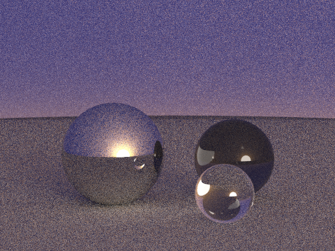

# FreePascalによる99行パストレの移植  
レイトレ界隈で知らぬ者のいない[99行パストレ](https://www.kevinbeason.com/smallpt/)を素直にFreePascalで記載  
あまり独自解釈を盛り込まないように比較的素直に写経しているつもり  

## smallptのNexEvent版sppne.pasのPDFについて  
[smallptのNextEvent版explicit.cpp](https://www.kevinbeason.com/smallpt/explicit.cpp)をFreePascalで記述したsppne.pasを記述した
際にpdfの考え方についてご本家のexplicit.cppの考え方をメモっておきます。  
光源側に向かう光に対する立法角はオブジェクトがすべて球なので光源の半径と距離から表せるθを考えると２π（１－cosθ）が立法角。
（ただしこれ上半球だけ。下半球を考慮するとその倍になる。こういう処理をしているのは光線のゆらぎを考える際に場合分けが不要だから）  
半球の立法角は２πなので本来は上記の式を２πで割るのがスジだが、光源自体が上半球のみなので全体の立法角はその半分のπが求める立法角。  
結果光源に向かう光線のpdfは2π(1-cosθ)/π、となる。  

## FreePascalのDynamicArrayのBlockwriteについて  
FreePascalのDynamicArrayは実態はポインタなのでBlockwriteではBlockwrite(f,DynamicArray,len)ではだめで  
> blockwrite(f,DynamicArray[0],len)が正解
